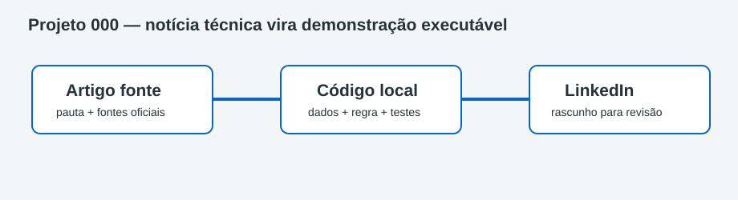

# Projeto 000 — Ambiente e padrão LinkedIn + código

Esta trilha usa somente os artigos da tarefa **Template LinkedIn Dados**. Ela não importa conteúdos do Radar Diário de Dados nem publica no LinkedIn.



## Ferramentas e função de cada uma

| Ferramenta | Função | Instalação necessária |
|---|---|---|
| VS Code | Ler artigo, código, dados, teste e SVG lado a lado | Recomendada |
| Python 3.10+ | Executar todas as demonstrações locais | Obrigatória |
| `venv` | Isolar futuras dependências | Incluída no Python |
| `unittest` | Validar a regra implementada | Incluída no Python |
| Git | Revisar alterações locais | Recomendado; push proibido sem aprovação |
| Markdown | Manter artigo e documentação versionáveis | Nenhuma |
| SVG | Explicar visualmente a implementação | Nenhuma |

## Passo a passo detalhado

```bash
cd "caminho/para/linkedin-data-engineering-articles"
code .
cd 000-configuracao-ambiente
python3 -m venv .venv
source .venv/bin/activate
python3 -m src.check
python3 -m unittest discover -s tests -v
```

No VS Code, instale a extensão **Python**, da Microsoft, e selecione `.venv/bin/python` em **Python: Select Interpreter**. Não é necessário instalar SDK cloud, fazer login ou configurar credenciais.

## Estrutura obrigatória dos artigos

| Arquivo/pasta | Conteúdo |
|---|---|
| `artigo-linkedin.md` | Material recuperado da tarefa de origem |
| `post-linkedin.md` | Versão curta conectando notícia e implementação |
| `README.md` | Tutorial completo e limites do laboratório |
| `src/demo.py` | Implementação local relacionada à notícia |
| `data/scenario.json` | Dados fictícios e seguros |
| `tests/test_demo.py` | Comportamento esperado |
| `docs/arquitetura.svg` | Fluxo visual |

## Site local com MkDocs

MkDocs converte os arquivos Markdown em um site navegável; Material for MkDocs fornece tema, busca e cópia de código. A instalação usa o `requirements-docs.txt` da raiz e é opcional:

```bash
cd "caminho/para/linkedin-data-engineering-articles"
source .venv/bin/activate
python3 -m pip install -r requirements-docs.txt
python3 -m mkdocs serve --config-file mkdocs.yml
```

Abra a URL mostrada no terminal e use `Ctrl+C` para encerrar. Para apenas validar e gerar HTML local, execute `python3 -m mkdocs build --strict --config-file mkdocs.yml`. A saída fica em `site-local/linkedin` e não é publicada.

## Conceitos de Engenharia de Dados aplicados

Leitura crítica de anúncios, proof of concept local, contratos, testes, rastreabilidade entre conteúdo e código e separação entre demonstração e produção.

## Pré-requisitos e possíveis custos

Python 3.10+ e VS Code. A execução é gratuita e local. Produtos citados nos artigos podem ser pagos, mas não são chamados nem provisionados.

## O que foi validado

O checker confirma o Python e as ferramentas locais sem ler credenciais. O teste valida o contrato mínimo.

## Solução de problemas

| Sintoma | Solução |
|---|---|
| `No module named src` | Entre na pasta do projeto antes de executar |
| Python antigo | Selecione Python 3.10+ no VS Code |
| Resultado diferente | Restaure `data/scenario.json` e repita o teste |
| Artigo menciona cloud login | Não execute; integrações são apenas contexto |

## Checklist de conclusão

- [ ] Abri a pasta `linkedin` no VS Code.
- [ ] Criei e ativei `.venv`.
- [ ] Executei checker e teste.
- [ ] Entendi a diferença entre notícia, demonstração e produção.
- [ ] Não publiquei, não fiz deploy e não executei `git push`.

## Tecnologias relacionadas ainda não utilizadas

Sem LinkedIn API, automação de postagem, SDK cloud, conta cloud, deploy, CI/CD ou recursos pagos.

## Referências oficiais

- [VS Code: Getting Started](https://code.visualstudio.com/docs/getstarted/getting-started)
- [Python no VS Code](https://code.visualstudio.com/docs/python/python-tutorial)
- [Ambientes virtuais Python](https://docs.python.org/3/library/venv.html)
- [unittest](https://docs.python.org/3/library/unittest.html)

Rascunho local; nada foi publicado.
