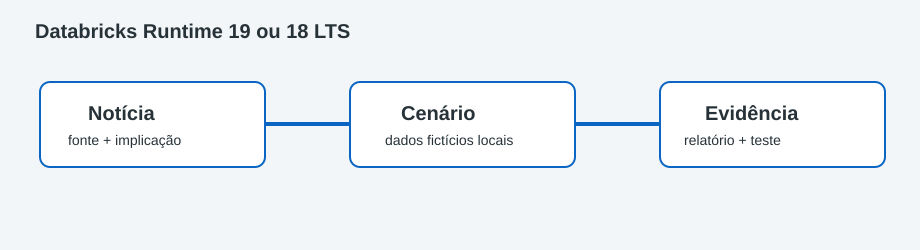

# Databricks Runtime 19 ou 18 LTS

> Artigo com implementação · Migração de runtime

Este projeto converte uma pauta da tarefa **Template LinkedIn Dados** em uma demonstração local. Não utiliza o Radar Diário de Dados e não publica nada automaticamente.



## Entenda o que foi feito

O texto recuperado está em [artigo-linkedin.md](artigo-linkedin.md). A versão curta para revisão está em [post-linkedin.md](post-linkedin.md). A implementação isola o conceito **migração de runtime** usando um cenário JSON seguro, uma função Python, relatório e teste.

## Ferramentas, bibliotecas e recursos utilizados

| Item | Função |
|---|---|
| Python 3.10+ | Implementa a demonstração sem SDK cloud |
| JSON | Entrada fictícia e relatório inspecionável |
| `argparse` | Permite trocar entrada e saída pelo terminal |
| `unittest` | Protege o resultado esperado |
| Markdown | Separa artigo original, post curto e tutorial |
| SVG | Mostra notícia → cenário → evidência |
| Tecnologia da notícia | Contexto arquitetural; não é acessada |

## Passo a passo detalhado

1. Conclua [Projeto 000](../000-configuracao-ambiente/README.md).
2. Entre na pasta e abra artigo, post e diagrama no VS Code:

```bash
cd "caminho/para/linkedin-data-engineering-articles"
cd "0001-databricks-runtime-19-vs-18-lts"
```

3. Leia `data/scenario.json` e preveja o resultado.
4. Leia a função `analyze()` em `src/demo.py`.
5. Execute:

```bash
python3 -m src.demo
cat data/output/report.json
python3 -m unittest discover -s tests -v
```

6. Altere um único valor fictício, preveja o novo relatório e repita os comandos.
7. Revise `post-linkedin.md` com sua opinião pessoal antes de qualquer publicação manual.

## Conceitos de Engenharia de Dados aplicados

Migração de runtime, configuração como dados, função determinística, cenário mínimo reproduzível, teste automatizado, rastreabilidade e distinção entre PoC e produção.

## Pré-requisitos e possíveis custos

Python 3.10+; execução local gratuita. O produto citado pela notícia pode exigir licenciamento ou consumo cloud, mas este laboratório não autentica, provisiona ou chama APIs.

## O que foi validado

O teste compara o relatório completo com o resultado esperado do cenário. A execução também grava `data/output/report.json`, ignorado pelo Git.

## Pratique

Adicione um segundo teste com uma condição-limite, explique a decisão em duas frases e ajuste o post sem afirmar que a simulação local substitui o serviço real.

## Solução de problemas

| Sintoma | Solução |
|---|---|
| `No module named src` | Execute a partir da pasta deste projeto |
| JSON inválido | Confira vírgulas, aspas e chaves em `scenario.json` |
| Teste falhou após experimento | Atualize conscientemente a expectativa ou restaure a amostra |
| Artigo menciona Preview/GA | Verifique novamente a fonte oficial antes de publicar |
| Serviço pede login | Pare: nenhuma integração cloud é necessária |

## Checklist de conclusão

- [ ] Li o artigo e conferi as fontes oficiais nele citadas.
- [ ] Consigo explicar a relação entre notícia e código.
- [ ] Executei demonstração e teste.
- [ ] Fiz uma alteração controlada com dados fictícios.
- [ ] Revisei o post para não confundir simulação com produção.
- [ ] Não publiquei, não fiz deploy e não executei `git push`.

## Tecnologias relacionadas ainda não utilizadas

Sem workspace cloud, SDK, credenciais, APIs, infraestrutura como código, CI/CD, LinkedIn API ou postagem automática.

## Referências oficiais

Consulte a seção de referências dentro de [artigo-linkedin.md](artigo-linkedin.md). Antes de publicar, revalide data, status GA/Preview/Beta, limitações e disponibilidade regional.

Rascunho local; nada foi publicado.
